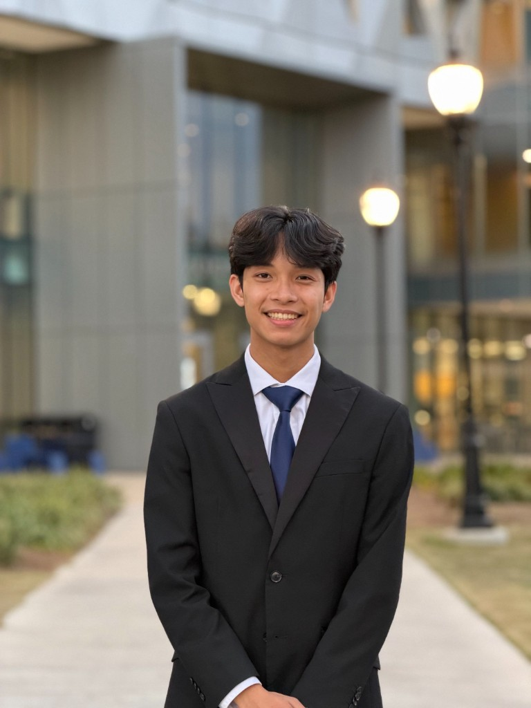

<!-- Badges -->
<p align="center">
  <a href="https://nextjs.org/"></a>
  <a href="https://react.dev/"></a>
  <a href="https://www.typescriptlang.org/"></a>
  <a href="https://tailwindcss.com/"></a>
  <a href="https://motion.dev/"></a>
  <a href="https://vercel.com/"></a>
</p>

---

<h1 align="center">Patrick Ouano</h1>

<p align="center">
  Personal portfolio of a third-year CS major at the University of Florida, software engineer and AI engineer, building products that can survive real hands, real constraints, and real handoffs.
</p>

<p align="center">
  <a href="https://www.patrickouano.dev/"></a>
  <a href="https://github.com/patrick-ouano"></a>
  <a href="https://www.linkedin.com/in/patrickouano/"></a>
  <a href="mailto:patrick.ouano123@gmail.com"></a>
  <a href="./portfolio/public/patrick-ouano-resume.pdf"></a>
</p>

<p align="center">
  
</p>

---

## Overview

This site is the home base for my work: projects, roles, a Cape Town case study, and the parts of me that are not on a resume.

I've spent the last year building software with AI inside it, including RAG pipelines, autonomous agents, and chatbots. My focus is always the user: making tools that are clear, reliable, and genuinely useful for the people who depend on them. I care most about whether the product helps someone do their job better and keeps working in real-world conditions.

Most recently I led the build of an AI chatbot and resource platform for **Housing Assembly**, a housing-rights NPO in Cape Town. Before that, I architected agents and ETL pipelines in the AI Lab at **Raia AI**. On the side, I shipped Gamify JSA for 200+ club members, a Minecraft-themed recipe app that won at SwampHacks, and a fog-of-war campus explorer.

Open to **SWE**, **AI**, and **cloud** internships.

---

## Site Map

| Page | What you'll find |
|------|------------------|
| **Home** | Hero, selected projects, Cape Town featured story |
| **Projects** | Full project archive with live embeds and stack tags |
| **Work** | Housing Assembly + Raia AI roles, and earlier experience |
| **About** | Bio, education, skills, leadership |
| **Cape Town** | Six-week study-abroad case study, week by week |
| **Personal** | Travel, hobbies, places that shaped me |
| **Contact** | Form + email / GitHub / LinkedIn |
| **Résumé** | Downloadable PDF |

---

## Featured Projects

### Housing Assembly
**Scrum Master / Technical Lead · 2026**

A refactored site, an AI chatbot on web and WhatsApp, and a searchable document library that non-technical staff maintain themselves. Built in Cape Town for tenants who live on WhatsApp, and designed so it keeps working after the engineers fly home.

`n8n` · `Railway` · `Vercel` · `GitHub Actions` · `Meta Cloud API` · `RAG`

→ [housingassembly.org.za](https://www.housingassembly.org.za/)

---

### OpenWorld
**Scrum Master / Full-Stack Developer · 2026**

A gamified campus exploration app with a fog-of-war map that reveals itself as you physically explore. Explore the Swamp, crack the trivia, collect the badges.

`MongoDB` · `Express` · `React` · `Node.js`

→ [open-world-app.vercel.app](https://open-world-app.vercel.app/)

---

### MealCraft
**Full-Stack Developer · 2026 · Best Everyday Life & Wellbeing at SwampHacks XI**

A Minecraft-themed recipe generator that turns a photo of your fridge into five recipes with nutrition macros.

`Next.js` · `TypeScript` · `Tailwind CSS` · `Gemini` · `Vercel`

→ [mealcraftai.vercel.app](https://mealcraftai.vercel.app/)

---

### Gamify JSA
**Lead Developer / Scrum Master · 2025**

A Discord bot that gamifies club participation for **200+ members** of the UF Japanese Student Association, with XP, ranks, daily and weekly quests, Wordle claims, dual leaderboards, and Google Sheets-backed event processing. Deployed 24/7 on a DigitalOcean droplet with systemd.

`Python` · `discord.py` · `Google Sheets API` · `gspread` · `DigitalOcean`

→ [github.com/patrick-ouano/Gamify_JSA](https://github.com/patrick-ouano/Gamify_JSA)

| XP | Rank |
|:--:|:-----|
| 0 | Newcomer |
| 50 | Daiyo's Classmate |
| 150 | Daiyo's Friend |
| 300 | Daiyo's Pet |
| 500 | JSA Regular |
| 750 | JSA Otaku |
| 1050 | Honorary JSA Board |

---

### UFFSA Website
**Contributor / Frontend Engineer · 2026**

Built the entire authentication frontend for the UF Filipino Student Association's website.

`JavaScript` · `HTML` · `CSS`

→ [uffsa.net](https://www.uffsa.net/)

---

## Experience

| Role | Org | Period |
|------|-----|--------|
| Software Engineer Intern | Housing Assembly, Cape Town (via EDU Africa) | May 2026 to Present |
| Student Associate, AI Lab | Raia AI, Gainesville | Jan 2026 to May 2026 |
| Treasurer | Japanese Student Association (UF) | May 2026 to Present |
| Membership Outreach Chair | Japanese Student Association (UF) | Sep 2025 to May 2026 |

**Housing Assembly**: Orchestrated n8n-based RAG workflows (GPT-4o-mini, embeddings, Pinecone) powering an AI chatbot for 2,000+ community members. Led a 4-person team while refactoring a legacy site onto Vercel with GitHub Actions CI, designed for non-technical handoff.

**Raia AI**: Architected autonomous agents across 5+ client engagements; engineered ETL pipelines turning 1,000+ unstructured documents into RAG-ready knowledge bases; ran 100+ simulated QA scenarios to cut hallucinations.

---

## Cape Town

<p align="center">
  
</p>

<p align="center"><em>Six weeks in Cape Town, learning who the software was really for.</em></p>

**May 30 – July 11, 2026** · 33.9249° S, 18.4241° E

Scrum Master and technical lead for Housing Assembly: website refactor, AI chatbot on web and WhatsApp, and a document library staff can maintain without touching code. The case study on the site walks through the work week by week.

---

## Tech Stack

### App
| Layer | Choices |
|-------|---------|
| Framework | **Next.js 16** (App Router), **React 19**, **TypeScript** |
| Styling | **Tailwind CSS 4**, custom design tokens, light/dark via `next-themes` |
| Motion | **Motion** for reveal, stagger, mask lines, and parallax |
| Content | Typed content modules in `lib/content/` (projects, work, about, personal) |
| Extras | **cobe** globe on the Personal page; live site embeds for projects |

### Quality & Deploy
| Concern | Tooling |
|---------|---------|
| Tests | **Vitest** + React Testing Library |
| Lint / types | ESLint (Next), `tsc --noEmit` |
| CI | GitHub Actions for lint, typecheck, security audit, test, and build |
| Hosting | **Vercel** (root directory = `portfolio/`) |

---

## Getting Started

### Prerequisites

- Node.js 20+
- npm

### Installation

1. Clone the repository:

   ```bash
   git clone https://github.com/patrick-ouano/Portfolio.git
   cd Portfolio/portfolio
   ```

2. Install dependencies:

   ```bash
   npm install
   ```

3. Run the development server:

   ```bash
   npm run dev
   ```

4. Open [http://localhost:3000](http://localhost:3000).

### Scripts

| Command | Description |
|---------|-------------|
| `npm run dev` | Start Next.js in development |
| `npm run build` | Production build |
| `npm start` | Serve the production build |
| `npm run lint` | ESLint |
| `npm run typecheck` | TypeScript (`tsc --noEmit`) |
| `npm test` | Vitest (single run) |
| `npm run test:watch` | Vitest watch mode |

---

## Project Structure

```
Portfolio/
├── .github/workflows/ci.yml   # Lint, typecheck, audit, test, build
├── README.md
└── portfolio/                 # Next.js app (Vercel root)
    ├── app/                   # Routes: home, projects, work, about, …
    │   ├── page.tsx
    │   ├── projects/
    │   ├── work/
    │   ├── about/
    │   ├── study-abroad/
    │   ├── personal/
    │   ├── contact/
    │   ├── resume/
    │   └── styleguide/
    ├── components/
    │   ├── site/              # Header, footer, page chrome
    │   ├── ui/                # Design system primitives
    │   ├── motion/            # Reveal, stagger, parallax, mask lines
    │   ├── projects/
    │   ├── work/
    │   ├── study-abroad/
    │   ├── personal/
    │   ├── contact/
    │   └── theme/             # Theme provider + toggle
    ├── lib/content/           # Typed site copy (single source of truth)
    └── public/                # Images, résumé PDF, project screenshots
```

---

## Design Notes

- **One composition per viewport**: brand and message first, with no dashboard clutter in the hero.
- **Content-driven**: pages pull from `lib/content/*` so copy and data stay out of the layout layer.
- **Motion with purpose**: reveals and parallax support hierarchy, not noise.
- **Built to be read**: typography and measure are tuned for long-form sections, especially Cape Town and About.

---

## Contact

| | |
|---|---|
| Live site | [patrickouano.dev](https://www.patrickouano.dev/) |
| Email | [patrick.ouano123@gmail.com](mailto:patrick.ouano123@gmail.com) |
| GitHub | [github.com/patrick-ouano](https://github.com/patrick-ouano) |
| LinkedIn | [linkedin.com/in/patrickouano](https://www.linkedin.com/in/patrickouano/) |
| Résumé | [patrick-ouano-resume.pdf](./portfolio/public/patrick-ouano-resume.pdf) |

<p align="center">
  <a href="https://www.patrickouano.dev/">patrickouano.dev</a>
  <br /><br />
  Built with Next.js · Deployed on Vercel · Made in Florida &amp; Cape Town
</p>
